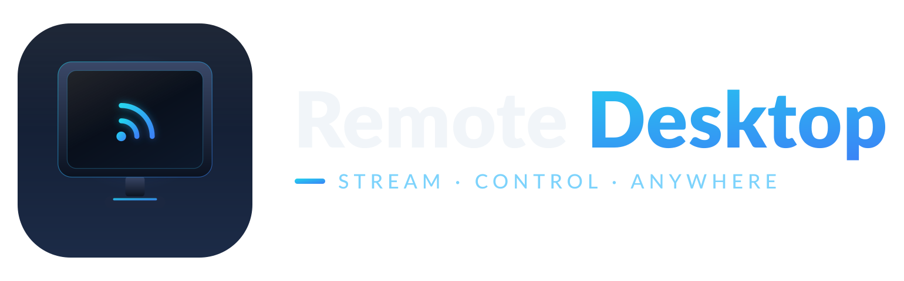

# Remote Desktop



> Stream your Linux X11 desktop to your phone — and control it with your
> fingers. A self-contained system: a UDP server that captures and H.264-encodes
> the local desktop, an Android client that decodes and streams it as a
> touchpad/keyboard, and a small SDL2 helper viewer for the desktop.

**Stack:** C++17 (Boost.Asio, X11/FFmpeg) · Java (Android, MediaCodec) · UDP

---

## Features

- **Low-latency video over UDP** — X11 capture via `XShmGetImage`, encoded with
  FFmpeg `libx264` (ultrafast / zerolatency / baseline), decoded on Android with
  `MediaCodec`.
- **H.264 over a lossy link** — frames are sliced into ≤1400-byte fragments with
  per-fragment checksums, delivered over plain UDP. Recovery happens with
  **FEC** (forward-error-correction parity blocks) first and **ARQ**
  (requested fragment retransmits) as fallback. SPS/PPS repeat on every frame
  plus a real IDR keyframe every 15 frames so clients sync in <1s.
- **Zero-setup control** — the Android app works as a trackpad: single-finger
  drag moves the mouse, double-tap = left click, two-finger tap = right click,
  two-finger drag = scroll.
- **On-screen keyboard** — translucent laptop-style overlay with qwerty/AWSD,
  arrow keys and `Ctrl`/`Shift`/`Alt` modifiers, plus hardware-keyboard
  forwarding (auto-Shift for uppercase letters).
- **More protocol support** — FEC / ARQ / GPU & audio / SSL toggles in the UI
  (`FEC`, `ARQ`, `GPU`, `AUD`, `SSL`).
- **Scanner** — finds servers on the LAN without typing the IP.
- **Desktop viewer** — an optional SDL2 client (with a 5×7 bitmap-font RTT
  overlay) to exercise the server straight from the desktop.

## How it works

```
┌────────────┐   XTest/input    ┌─────────────┐   UDP :9876   ┌───────────┐
│   Desktop  │◄─────────────────│    server   │────────────────│  Android │
│  (X11) app │  mouse + keys    │ (C++/asio)  │  H.264 + FEC  │  client  │
└────────────┘                  └─────────────┘◄───────────────└───────────┘
    screen capture (XShm) ──────►  frame bytes   ┌─────────────┐
                                  (libx264) ─────►│ desktop-    │
                                                  │ viewer (SDL)│
                                                  └─────────────┘
```

1. The **server** captures the X11 root window (MIT-SHM), encodes it as H.264
   and slices each access unit into UDP fragments. It honours input packets
   from handshake-verified clients via `XTestFakeMotionEvent`/`ButtonEvent`/
   `KeyEvent`.
2. The **Android client** performs a UDP handshake, reassembles fragmented
   frames (FEC-first, ARQ-fallback), decodes with `MediaCodec`, converts
   YUV→ARGB and renders on a `SurfaceView` with a remote-cursor overlay. Touch
   and key events are mapped to XTest-compatible packets and sent back.
3. The **desktop-viewer** is the same UDP protocol implemented as a minimal
   SDL2 + `libavcodec` client — useful for debugging the server without a phone.

The wire format is documented in [`server/src/protocol.h`](server/src/protocol.h)
(21-byte packet header, magic `0x5244`, per-fragment checksum, packet types).

## Repository layout

| Path               | Purpose                                                                 |
|--------------------|-------------------------------------------------------------------------|
| `server/`          | C++ UDP server: X11 capture, H.264 encoder, UDP transport (FEC+ARQ), XTest input handler |
| `android/`         | Android client (Java): UDP + reassembly, `MediaCodec` decode, touchpad/keyboard UI |
| `desktop-viewer/`  | Minimal SDL2 + `libavcodec` client that talks the same wire protocol      |
| `branding/`        | Inkscape SVG brand assets: app icon, logo lockups (dark/light), colour palette |

## Requirements

- **Server & viewer (Linux):** CMake ≥ 3.16, C++17 compiler, pkg-config, Boost
  (`boost/asio`), X11 dev libraries (`x11`, `xext`, `xfixes`, `xtst`), FFmpeg dev
  libraries (`libavformat`, `libavcodec`, `libavutil`, `libswscale`). The viewer
  additionally needs **SDL2**.
- **Android:** Android Gradle Plugin 8.13 / Gradle 8.13 wrapper, SDK
  `compileSdk 36`, `minSdk 24`, `targetSdk 36`. Only dependency is
  `androidx.appcompat:appcompat:1.6.1`.

On Debian/Ubuntu the server/viewer deps map to:

```bash
sudo apt install cmake g++ pkg-config libboost-dev \
     libx11-dev libxext-dev libxfixes-dev libxtst-dev \
     libavformat-dev libavcodec-dev libavutil-dev libswscale-dev libsdl2-dev
```

## Build & run

### 1. Server (`server/`)

```bash
cmake -S server -B server/build
cmake --build server/build                     # build/remote_desktop_server
DISPLAY=:1 ./server/build/remote_desktop_server -p 9876   # default FPS 60, bitrate 3000 kbit/s
```

See [`server/README.md`](server/README.md) for full details.

### 2. Android client (`android/`)

```bash
cd android
./gradlew --offline assembleDebug
adb install -r app/build/outputs/apk/debug/app-debug.apk
```

Open the app, enter the server IP + UDP port (`9876`), tap **CONNECT**, rotate
to landscape and go fullscreen. See [`android/README.md`](android/README.md)
for the full gesture/keyboard reference.

### 3. Desktop viewer (`desktop-viewer/`)

```bash
cmake -S desktop-viewer -B desktop-viewer/build
cmake --build desktop-viewer/build             # build/desktop_viewer
./desktop-viewer/build/desktop_viewer -h 127.0.0.1 -p 9876 -t 60
```

## Brand

The project ships with an editable **Inkscape SVG** brand kit in [`branding/`](branding/):

- `remote-desktop-icon.svg` — app icon (monitor + cast glyph on navy, cyan→blue accent)
- `remote-desktop-logo.svg` / `remote-desktop-logo-light.svg` — horizontal wordmark lockups
- `remote-desktop-palette.svg` — colour palette (`#0B1220`, `#1C2B47`, `#22D3EE`, `#3B82F6`, `#7DD3FC`, `#F1F5F9`)
- `preview/` — rendered PNGs (also exported as Android mipmaps + adaptive icon)

## License

[GPL-3.0](LICENSE)